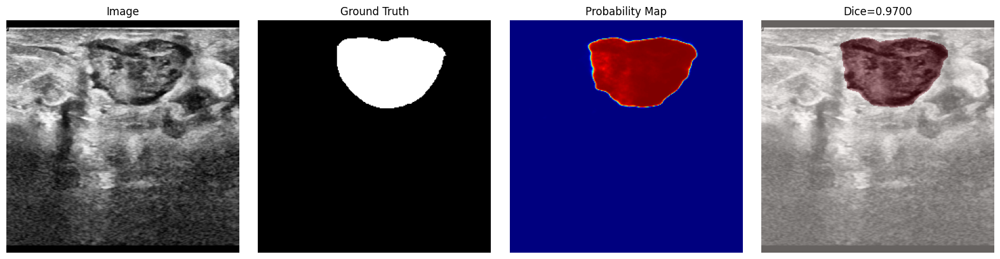

# Lightweight Attention U-Net for Breast Tumor Segmentation

This repository contains the implementation of a highly optimized, lightweight **Attention U-Net** designed for the segmentation of benign and malignant breast tumors in ultrasound imaging. 

By replacing standard skip-connections with active Spatial Attention Gates and using a robust `EfficientNet-B0` backbone, the network actively filters acoustic speckle noise and highlights tumor boundaries while requiring only a fraction of the computational power of standard medical segmentation networks.

<div align="center">
  
  <p><em>Example: The network successfully bounding an irregular, lobulated tumor while actively suppressing acoustic shadowing and surrounding tissue noise.</em></p>
</div>

---

## 🎯 Key Achievements & Results

Our experimental validation highlights two distinct optimization milestones:

1. **Standard Attention U-Net**: Reached a peak Validation Dice Score of **0.7600**.
2. **PSO Optimized Version**: By employing Particle Swarm Optimization (PSO) to fine-tune the hyperparameter landscape (learning rates, loss weights, dropout regularization), the network achieved a peak Validation Dice Score of **0.8021**.

### Performance Metrics
* **Peak Dice Score:** `0.8021` (PSO Optimized)
* **Model Parameters:** `4,188,585 (~4.19M)` 
* **Inference Speed:** `~40ms per image (24.8 FPS)` directly on a standard CPU.
* **Loss Objective:** Hybrid Custom Loss `(0.7 * Tversky Loss + 0.3 * Focal Loss)`

---

## 🧠 Architecture Overview

### 1. The Encoder (EfficientNet-B0)
The network utilizes a pretrained `efficientnet_b0` feature extractor. It leverages ImageNet weights to circumvent training from scratch on limited grayscale clinical datasets. The backbone is exceptionally efficient, making up ~85.8% of the model's total parameters.

### 2. Spatial Attention Gates
Standard U-Nets suffer from redundant feature propagation, where noisy high-resolution spatial features are passed directly to the decoder. 

This model integrates **Attention Gates** before concatenation. The deep, semantically rich decoder signals act as a gating mechanism to dynamically filter out speckle artifacts and accentuate the salient regions (tumors) in the skip connections.

### 3. Spatial Dropout Regularization
To prevent co-adaptation in spatial feature grids, the decoder utilizes `nn.Dropout2d`. It drops entire spatial channels instead of individual pixels, preventing the network from interpolating missing pixels from adjacent neighbors.

---

## ⚙️ The Hybrid Loss Function

Ultrasound segmentation suffers from extreme class imbalance (tumor pixels occupy < 5% of the image area). Standard Cross-Entropy biases the network heavily toward the background. 

This repository implements a custom hybrid loss function:
* **Tversky Loss (70% Weight):** Extends the Dice coefficient to differentially weight False Positives and False Negatives. We heavily penalize False Negatives (missing a tumor is clinically dangerous).
* **Focal Loss (30% Weight):** Dynamically scales down the loss contribution of easy-to-classify background pixels, forcing backpropagation to focus on hard, fuzzy boundary pixels.

---

## 🛠️ Data Preprocessing & Augmentation Pipeline

The input data pipeline relies on a rigorous preprocessing suite designed specifically for acoustic artifacts:
* **Pad-to-Square:** Prevents geometric distortion.
* **CLAHE (Contrast Limited Adaptive Histogram Equalization):** Boosts local edge contrast.
* **Elastic Deformation:** Simulates soft-tissue compression from varying sonographer probe pressure.
* **Coarse Dropout:** Simulates shadowing artifacts where the acoustic signal is blocked by dense structures (like ribs or calcifications).
* **Additional Regimes:** Gaussian Noise (speckle simulation), Gaussian Blur, Scale Jittering, and Affine Rotations.

---

## 📂 Project Structure

```text
├── notebooks/
│   ├── attention-u-net.ipynb     # Base model training & validation pipeline
│   ├── pso_optimized.ipynb       # Hyperparameter tuning utilizing Particle Swarm Optimization
│   ├── train.ipynb               # Modular training script
│   ├── test.ipynb                # Validation and metric calculation
│   ├── inference.ipynb           # Single-image inference demonstrations
│   └── visualize.ipynb           # Post-training result visualization
├── checkpoints/                  # Saved .bin model weights
├── docs/                         # Detailed architecture specifications & presentation diagrams
├── scripts/                      # Auxiliary python scripts (e.g. visualize_augmentations.py)
├── main.py                       # Project entry point
└── README.md                     # This file
```
